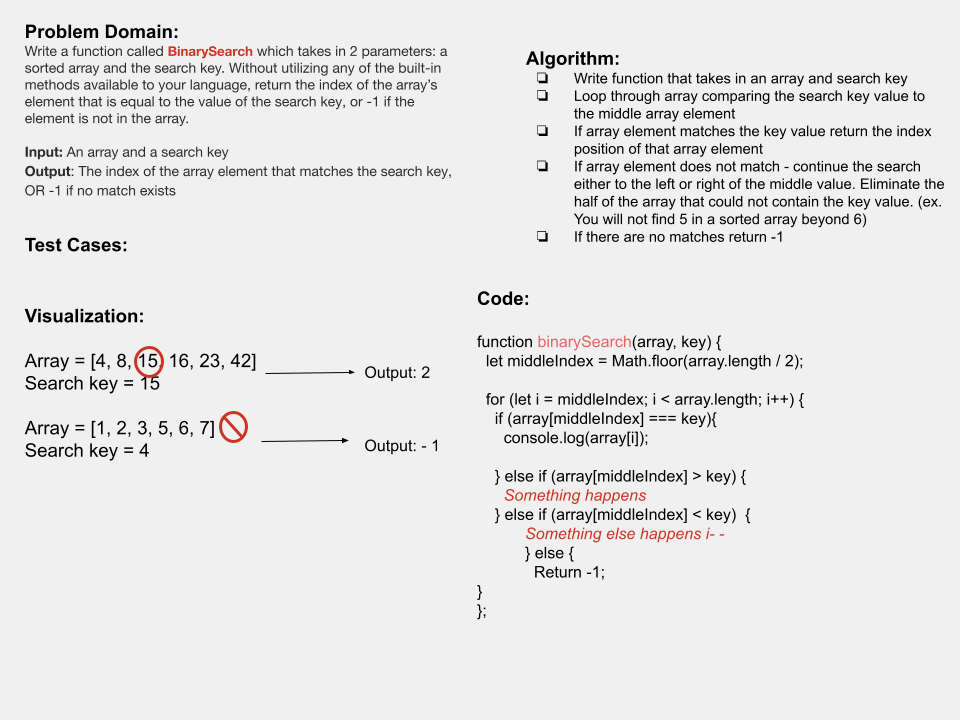

# Array Binary Search

## Whiteboard Process

discussed the function with Elizabeth. Will revisit to complete the function.

## Approach & Efficiency

I worked on the whiteboard independently and then discussed the function through with Elizabeth. I was able get the function to return the value of the middleIndex, but was unsure how to move forward and how to switch the loop to go either way depending on the key value.
