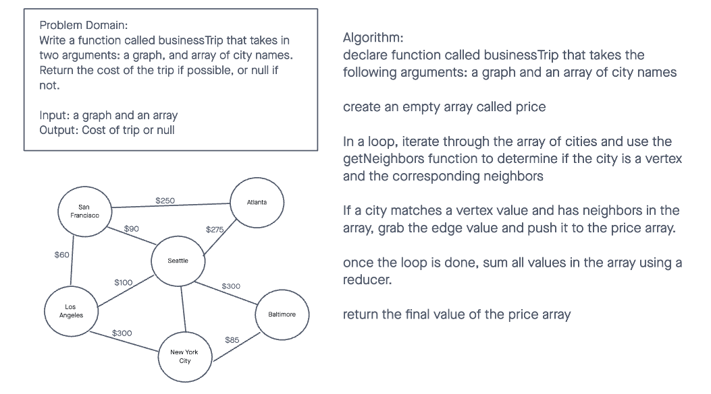

# Graphs

Code Challenge 37 Algorithm

## Challenge

Implement your own Graph. The graph should be represented as an adjacency list, and should include the following methods:

- add node: adds a node to the graph
- add edge: adds a new edge between two nodes
- get nodes: returns all the nodes in a graph as a collection(set, list, or similar)
- get neighbors: returns a collection of edges connected to a given node
- size: returns total number of nodes

## Approach & Efficiency
<!-- What approach did you take? Why? What is the Big O space/time for this approach? -->

## API
<!-- Description of each method publicly available in your Graph -->
