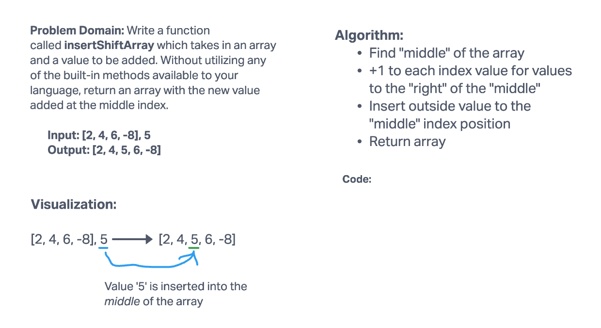
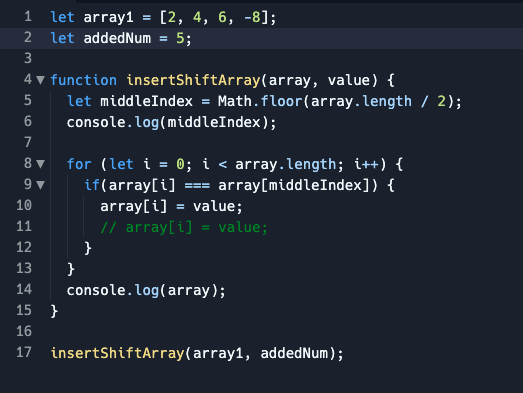

# Insert to Middle of an Array

## Whiteboard Process

## Approach & Efficiency

I was unable to get the code I wrote to shift the other values index's over one. Submitting the code I was playing with for now.

I worked with Elizabeth Hammes on the whiteboard.

Some resources used:

https://stackoverflow.com/questions/30375616/find-the-index-of-an-array-element-without-using-built-in-indexof-function
