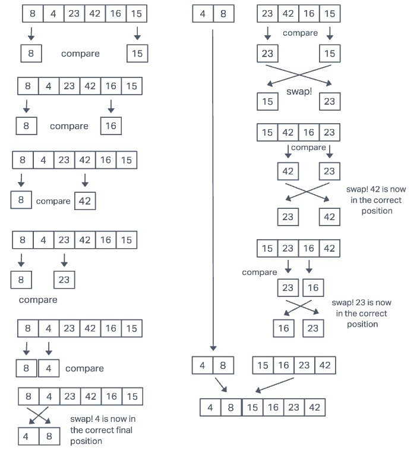

# Blog Notes: Quick Sort

QuickSort can be considered a "divide and conquer" algorithm. An array is split at a pivot point. The last value at each now split array is compared to the other values within their arrays. Once the last value is compared to a value that is higher than itself, each value will "swap" places.

## Visualization

